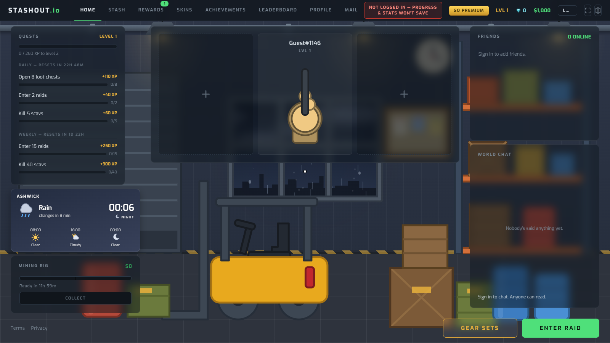
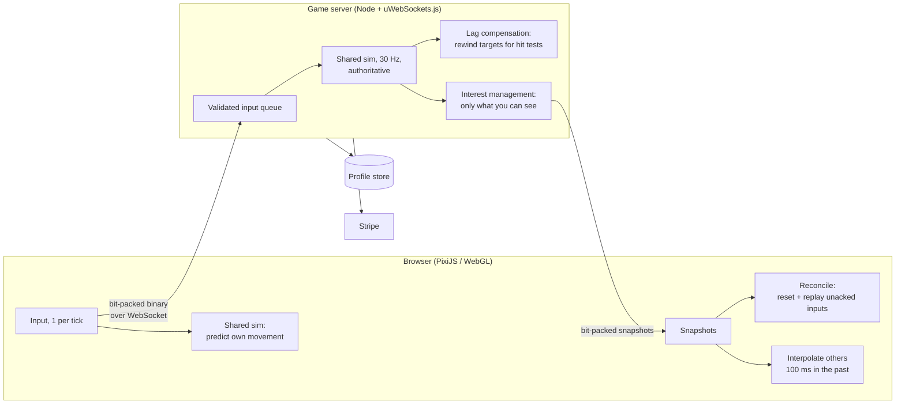

# Stashout

A multiplayer top-down extraction shooter that runs in the browser. Drop into a raid with the gear
you choose to risk, loot, fight other players and AI, and get out alive to keep it. Die and it's
gone.

Solo project, July 2026 to present. **The source is private**; this repo is a tour of how it's
built, with verbatim excerpts of the core netcode in [`excerpts/`](excerpts/).

**90-second pre-alpha demo:** lobby, a raid, looting and extraction.

https://github.com/user-attachments/assets/9f5df8de-5200-42ff-bfef-e51ad9132349

## At a glance

- **~75,000 lines of TypeScript** across a shared simulation (17k), the game server (19k) and the
  client (39k)
- **869 automated tests** in 83 files, plus a smoke test that drives real WebSocket clients against
  a live server, all on every push
- **770 commits** since the first on 2026-07-11
- **53 weapons, 135 items, 3 kinds of AI** (scavs, rival PMCs, a boss), all defined as data
  tables rather than code

## Architecture

The rules the whole design hangs on:

1. **The server is the only authority.** It runs a fixed 30 Hz simulation and decides every
   outcome. The client predicts and renders; it never decides whether a shot hit.
2. **One simulation, two places.** Movement, projectiles and combat live in a shared,
   deterministic module that runs unchanged on both client and server. No `Math.random()` (a
   seeded RNG instead), no wall-clock time, no order-dependent float accumulation. A gameplay rule
   implemented twice is treated as a bug.
3. **Never trust the client.** Every input is validated server-side: movement speed, fire rate and
   inventory operations are checked, and inputs are token-bucket rate limited, so a client flooding
   inputs to move faster gets its own prediction corrected back.
4. **Interest management from day one.** Each client only receives entities within its view
   radius and line of sight. That is also the anti-wallhack layer: data about a player you can't
   see never reaches your machine, so there's nothing to reveal.
5. **Content is data.** Weapons, attachments, loot tables and AI parameters are declarative
   tables. Adding a gun means adding an entry, not writing a class.

## The netcode

**Client-side prediction.** Your own movement runs locally the moment you press a key, through
the same shared sim the server uses. You never wait a round trip to move.

**Server reconciliation.** Every snapshot says which of your inputs the server has applied. The
client resets to the server's position and replays the inputs still in flight. Because the sim is
deterministic, agreement means the replay lands exactly where you already were, so nothing visibly
moves. A real disagreement (packet loss, a rejected input) is folded into a decaying render offset
so it reads as a nudge rather than a teleport.
→ [`excerpts/reconciliation.ts`](excerpts/reconciliation.ts)

**Lag compensation.** You see other players 100 ms in the past (interpolation) plus half your
ping. So when your bullet is tested, the server rewinds each target to where you actually saw
them, using a one-second ring buffer of positions, capped at 8 ticks (~267 ms) so a victim can't
be hit long after reaching cover.
→ [`excerpts/lag-compensation.ts`](excerpts/lag-compensation.ts)

**A custom binary protocol.** No JSON for game state. 87 message kinds are bit-packed with
hand-written encoders. Positions are quantized to 16 bits (~11.7 mm across the 768 m map) and
angles to 12. The client rounds its own aim through the same quantization before simulating, so
what it predicts with is bit-identical to what the server decodes; skip that and every
reconciliation replay drifts slightly.
→ [`excerpts/bitbuffer.ts`](excerpts/bitbuffer.ts) · [`excerpts/quantization.ts`](excerpts/quantization.ts)

**Tested under bad networks, not just localhost.** Any client can run with simulated latency,
jitter and packet loss in both directions (`?lag=100&jitter=20&loss=0.02`), and the automated
browser checks use the same switch.
→ [`excerpts/network-simulator.ts`](excerpts/network-simulator.ts)

## Testing and CI

- **Determinism tests** run 2,000 random inputs through the full sim twice and require bit-identical
  results (`Object.is` on every float), and check the exact property reconciliation depends on:
  replaying a suffix of inputs from a mid-run snapshot lands where the straight run did.
  → [`excerpts/determinism.test.ts`](excerpts/determinism.test.ts)
- **Protocol round-trip tests:** encode, then decode, gives the identical message.
- **Server behaviour tests** drive the real message handlers with encoded bytes, the same surface
  a hostile client has.
- **An end-to-end smoke test** boots the real server and plays through it over real WebSockets:
  accounts, deploying, inventory, persistence.
- **A hostile-client smoke test** attacks the live server the way an abuser would: message floods,
  connection floods, guest-key enumeration, ban evasion, checkout spam, impersonation. Every
  refusal is paired with a control proving the legitimate version still works, so a limit can't
  quietly widen into uselessness or tighten onto real players. It has caught three real bugs.
- **Headless browser checks** load the real client, enter a live raid and audit what actually
  rendered (fonts, reduced-motion behaviour), in their own workflow so they only run when
  rendering can have changed.
- **GitHub Actions** runs lint, typecheck, tests and both smoke tests on every push, and fails if
  the generated item art is stale. A regression test has to be
  seen failing without its fix before the fix lands.

## What's in the game

- Extraction loop with a persistent stash, grid inventory, gear sets and a death kit
- PvE: scavs, rival PMCs and a boss, all server-side AI
- Positional audio: directional gunshots and footsteps, with headsets that change what you hear
- Day/night cycle and weather, destructible cover, doors, grenades, stairs and underground layers
- Armour that degrades per hit, with repairs and a trader economy
- Accounts with Google and Discord sign-in, friends, chat and in-game mail
- Stripe payments with per-account admin permissions

## Stack

TypeScript 5.8 (strict) · PixiJS 8 (WebGL) · Vite 6 · Node.js + uWebSockets.js · Web Audio API ·
Vitest 3 · Stripe · GitHub Actions. Persistence sits behind a store interface, currently
file-backed with atomic writes.

---

Built by **Anish Gupta** · [LinkedIn](https://www.linkedin.com/in/anishgupta25/) ·
[GitHub](https://github.com/theflamebeast)

© 2026 Anish Gupta. All rights reserved. The excerpts are here to read, not to reuse.
